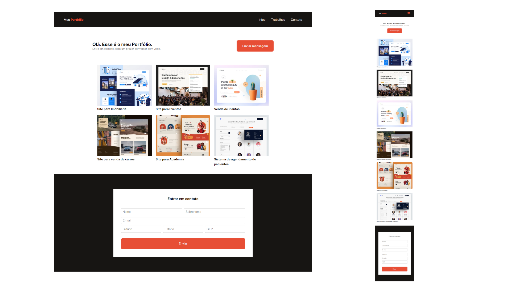

# explorer-classroom-portfolio-main
 Classroom para ter um melhor entendimento sobre responsividade.

  

## 🖥️ Projeto
Projeto construindo na classroom sobre responsividade, e na ocasião pudemos construir um portfolio que contém imagens, tags semânticas,
responsivas e outras técnicas com flex e grid.

## 🚀 Tecnologias
Foi desenvolvido esse projeto com as seguintes tecnologias:

- HTML
- CSS
- JAVASCRIPT
- GIT
- GITHUB
